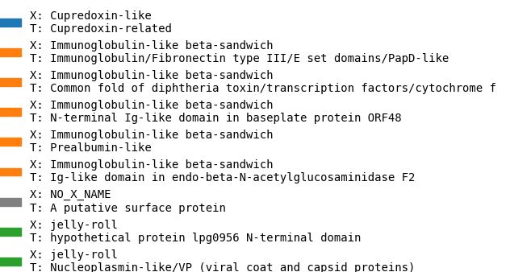
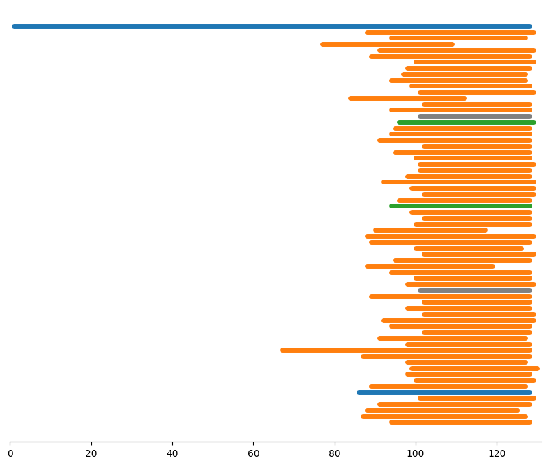

# pLM-BLAST

pLM-BLAST is a sensitive remote homology detection tool based on the comparison of residue embeddings obtained from protein language models such as ProtTrans5. It is available as a stand-alone package as well as an easy-to-use web server within the [MPI Bioinformatics Toolkit](https://toolkit.tuebingen.mpg.de/tools/plmblast), where pre-computed databases can be searched.

## Table of contents
* [ Installation ](#Installation)
* [ Usage ](#Usage)
    + [Databases](#databases)
    + [Searching a database](#searching-a-database)
    + [Results visualisation](#results-visualisation)
    + [Usage example](examples/README.md)
* [ Remarks ](#Remarks)
    + [How to cite](#how-to-cite)
    + [Funding](#funding)
    + [Contact](#contact)
    + [Changelog](#changelog)

# Installation

Create a conda environment:
```bash
conda create --name plmblast python=3.10
conda activate plmblast
# Install pip in the environment
conda install pip
```

Install pLM-BLAST using `requirements.txt`:
```bash
pip install -r requirements.txt
```

# Usage
## Databases

Pre-computed databases can be downloaded from http://ftp.tuebingen.mpg.de/pub/protevo/toolkit/databases/plmblast_dbs. pLM-BLAST can use any kind of embeddings, which are in the form of `(seqlen, embdim)`.

The `embeddings.py` script can be used to create a custom database (`T5` based model such as `prott5` or `esm`-family ) from a CSV or FASTA file. For example, the first lines of the CSV file for the ECOD database are:

```
,id,description,sequence
0,ECOD_000151743_e4aybQ1,"ECOD_000151743_e4aybQ1 | 4146.1.1.2 | 4AYB Q:33-82 | A: alpha bundles, X: NO_X_NAME, H: NO_H_NAME, T: YqgQ-like, F: RNA_pol_Rpo13 | Protein: DNA-DIRECTED RNA POLYMERASE",FPKLSIQDIELLMKNTEIWDNLLNGKISVDEAKRLFEDNYKDYEKRDSRR
1,ECOD_000399743_e3nmdE1,"ECOD_000399743_e3nmdE1 | 5027.1.1.3 | 3NMD E:3-53 | A: extended segments, X: NO_X_NAME, H: NO_H_NAME, T: Preprotein translocase SecE subunit, F: DD_cGKI-beta | Protein: cGMP Dependent PRotein Kinase",LRDLQYALQEKIEELRQRDALIDELELELDQKDELIQMLQNELDKYRSVI
2,ECOD_002164660_e6atuF1,"ECOD_002164660_e6atuF1 | 927.1.1.1 | 6ATU F:8-57 | A: few secondary structure elements, X: NO_X_NAME, H: NO_H_NAME, T: Elafin-like, F: WAP | Protein: Elafin",PVSTKPGSCPIILIRCAMLNPPNRCLKDTDCPGIKKCCEGSCGMACFVPQ
```

If the input file is in CSV format, use `-cname` to specify in which column the sequences are stored. 

It is recommended to sort the input sequences by length before running `embeddings.py`.

```bash
# CSV input
python embeddings.py start database.csv database -embedder pt -cname sequence --gpu -bs 0 --asdir
# FASTA input
python embeddings.py start database.fasta database -embedder pt --gpu -bs 0 --asdir
```

In the examples above, `database` defines a directory where sequence embeddings are stored.

The batch size (number of sequences per batch) is set with the `-bs` option. Setting `-bs` to `0` activates the adaptive mode, in which the batch size is set so that all included sequences have no more than 3000 residues (this value can be changed with `--res_per_batch`).

The use of `--gpu` is highly recommended for large datasets. To run `embeddings.py` on multiple GPUs, specify `-proc X` where `X` is the number of GPU devices you want to use.

Finally, create an additional file with flattened embeddings for the chunk cosine similarity scan, a procedure used to speed up database searches. To do this, use the `dbtofile.py` script with the database name as the only parameter:

```bash
python scripts/dbtofile.py database 
```
A new file `emb.64` will appear in the database directory. The database is now ready for use.

### Checkpointing feature

When dealing with large databases, it may be helpful to resume previously stopped or interrupted computations. When `embeddings.py` encounters an exception or keyboard interrupt, the main process captures the actual computation steps in the checkpoint file. If you want to resume, type:

```bash
python embeddings.py resume database
``` 

## Searching a database

To search a database `database` with a FASTA sequence in `query.fas`, we first need to compute the embedding:

```bash
python embeddings.py start query.fas query.pt
```

Then the `plmblast.py` script can be used to search the database:

```bash
python ./scripts/plmblast.py database query output.csv -cpc 70
```
You can also perform an all vs. all search by typing:
```bash
python ./scripts/plmblast.py database database output.csv -cpc 70
```

:sun_with_face: Note that only the base filename should be specified for the query and database (extensions are added automatically) :sun_with_face: 

The `-cpc X` with `X` > 0 option enables the use of cosine similarity pre-screening, which improves search speed. This option is recommended for typical applications, such as query vs database search. Follow [the link](examples/README.md) for more examples and run `plmblast.py -h` for more options. 


## Results visualisation

The results of searching a database with a single query sequence can be visualized using the `plot.py` script. For example:

```bash
python ./scripts/plot.py results.csv query.fas plot.png -mode score -ecod
```

Where `results.csv` are the results of the `plmblast.py` script, `query.fas` is the query sequence in FASTA format, and `plot.png` is the plot file that will be generated.

The `-mode` option is used to specify the order of the hits in the plot. `score` causes the hits to be sorted by score, while `qend` (default) causes the hits to be sorted by the end position of the match in the query. In both modes, the bars corresponding to each hit are colored according to the score.

The additional flag `-ecod` can be used to color the hits according to the [ECOD](https://www.rcsb.org/docs/search-and-browse/browse-options/ecod) classification. When this flag is used, an additional legend plot will be generated (`.legend.png` extension).

An example of generating the images below can be found in [onevsall.sh](examples/onevsall.sh). 

<div style="display: flex; justify-content: center;">
  <div style="flex: 1; text-align: center;">
    
  </div>
  <div style="flex: 1; text-align: center;">
    
  </div>
</div>

# Remarks

## How to cite?
If you find the `pLM-BLAST` useful, please cite:

"*pLM-BLAST – distant homology detection based on direct comparison of sequence representations from protein language models*" \
Kamil Kaminski, Jan Ludwiczak, Kamil Pawlicki, Vikram Alva, and Stanislaw Dunin-Horkawicz \
[Link](https://doi.org/10.1093/bioinformatics/btad579)

## Contact
If you have any questions, problems, or suggestions, please contact [us](https://ibe.biol.uw.edu.pl/en/835-2/research-groups/laboratory-of-structural-bioinformatics/).

## Funding
This work was supported by the First TEAM program of the Foundation for Polish Science co-financed by the European Union under the European Regional Development Fund.

# Changelog

* 26/09/2023 Improved embedding extraction script, calculations can now be resumed if interrupted, see databases section for more info.
* 26/09/2023 Improved adaptive batching strategy for `-bs 0` option, batch size is now divisible by 4 for better performance, and `-res_per_batch` options have been added.
* 9/10/2023 added support for `hdf5` files for embedding generation, soon we will add support for the `run_plmblast.py` script.
* 9/10/2023 added multi-processing feature to embedding generation, `-nproc X` options will now spawn `X` independent processes.
* 27/10/2023 added `examples` directory with end-to-end usages
* 26/11/2023 added parallelism to cosine prescreening - which gives a huge performance boost, especially for multiple query sequences
* 05/12/2023 added signal enhancement "*Embedding-based alignment: combining protein language models and alignment approaches to detect structural similarities in the twilight-zone*": https://www.biorxiv.org/content/10.1101/2022.12.13.520313v2
* 22/02/2024 improved RAM consumption in the prescreening process - additionally whole procedure will be faster now
